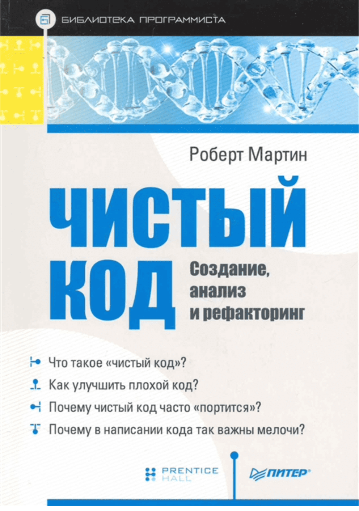
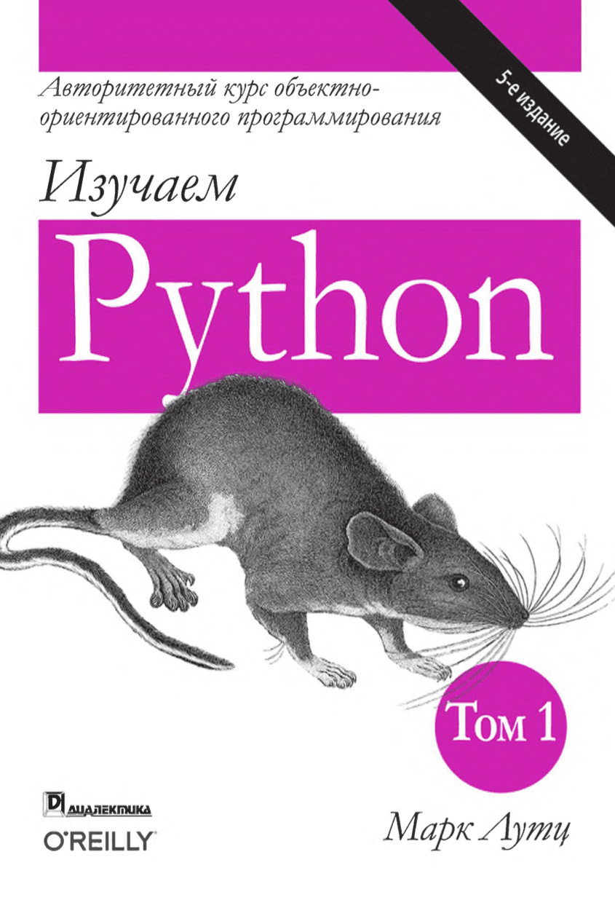
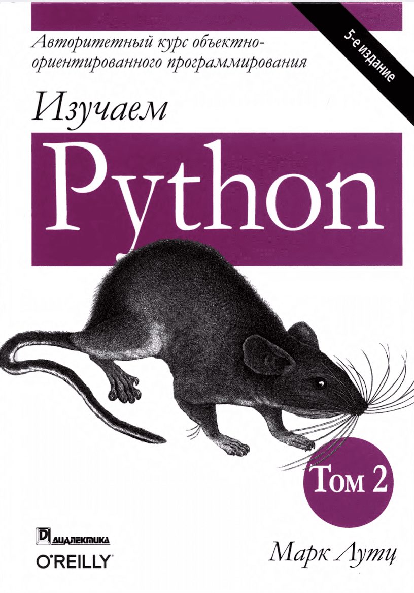
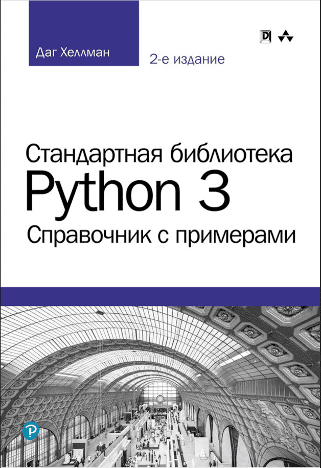
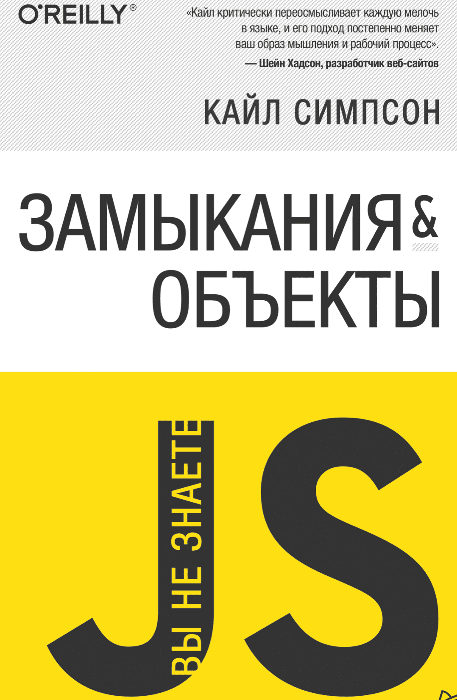

<h2>Привет меня зовут Александр!</h2>
<p>Я Python developer и TechOps</p>


### 🛠 Мои инструменты

<p>
    <a href="https://www.python.org"></a>
    <a href="https://developer.mozilla.org/ru/docs/Web/JavaScript"></a>
    <a href="https://developer.mozilla.org/ru/docs/Web/HTML"></a>
    <a href="https://www.sql.ru"></a>
</p>

### 🗃 Фреймворки и библиотеки

<p>
    <a href="https://www.djangoproject.com"></a>
    <a href="https://fastapi.tiangolo.com" src="https://img.shields.io/badge/FastAPI-005571?style=for-the-badge&logo=fastapi"></a>
    <a href="https://vuejs.org"></a>
    <a href="https://getbootstrap.com"></a>
    <a href="https://docs.pytest.org/"></a>
    <a href="https://jestjs.io/ru/"></a>
    <a href="https://jinja.palletsprojects.com/"></a>
    <a href="https://firebase.google.com"></a>
 
</p>

### 🏦 Базы данных и облачные хранилища

<p>
    <a href="https://www.postgresql.org"></a>
    <a href="https://pages.github.com"></a>
    <a href="https://www.sqlite.org/index.html"></a>
    <a href="https://aws.amazon.com"></a>
    
</p>

### 💽 Инструменты и программы 🖥

<p>
    <a href="https://www.postman.com"></a>
    <a href="https://www.npmjs.com"></a>
    <a href="https://jupyter.org"></a>
    <a href="https://www.gnu.org/software/bash/"></a>
    <a href="https://git-scm.com"></a>
    <a href="https://github.com/adam-p/markdown-here/wiki/Markdown-Cheatsheet"></a>
    <a href="https://www.figma.com"></a>
    <a href="https://developer.mozilla.org/ru/docs/Learn/Getting_started_with_the_web/CSS_basics"></a>
    <a href="https://webpack.js.org"></a>
    <a href="https://ubuntu.com"></a>
    <a href="https://www.debian.org"></a>
    <a href="https://www.docker.com"></a>
    <a href="https://www.linux.org"></a>
    <a href="https://nginx.org"></a> 
    <a href="https://pypi.org"></a>
    <a href="https://www.sketch.com"></a>

</p>

### 🪄 IDE

<p>
    <a href="https://www.jetbrains.com/ru-ru/pycharm/"></a>
    <a href="https://code.visualstudio.com"></a>
</p>

### 💻 Мой рабочий ноутбук

<p>
<a href="https://www.apple.com/ru/shop/buy-mac/macbook-pro/13-дюймовый-«серый-космос»-процессор-2,0-ггц,-4-ядерный-intel-core-i5-с-графическим-процессором-intel-iris-plus-graphics-512гб"></a>
</p>


#### 📖 Прочитано 

<p>
    <a href=""></a>
    <a href=""></a>
    <a href=""></a>
    <a href=""></a>
    <a href=""></a>
    <a href=""></a>
    <a href=""></a>
    <a href=""></a>
    <a href=""></a>
    <a href=""></a>
    <a href=""></a>
    <a href=""></a>
    <a href=""></a>
    <a href=""></a>
</p> 

<!--START_SECTION:waka-->


**🐱 My Github Data** 

> 🏆 136 Contributions in the Year 2021
 > 
> 📦 36.5 kB Used in Github's Storage 
 > 
> 💼 Opted to Hire
 > 
> 📜 11 Public Repositories 
 > 
> 🔑 4 Private Repositories  
 > 
**I'm a Night 🦉** 

```text
🌞 Morning    15 commits     █░░░░░░░░░░░░░░░░░░░░░░░░   5.51% 
🌆 Daytime    86 commits     ████████░░░░░░░░░░░░░░░░░   31.62% 
🌃 Evening    85 commits     ███████░░░░░░░░░░░░░░░░░░   31.25% 
🌙 Night      86 commits     ████████░░░░░░░░░░░░░░░░░   31.62%

```
📅 **I'm Most Productive on Monday** 

```text
Monday       66 commits     ██████░░░░░░░░░░░░░░░░░░░   24.26% 
Tuesday      34 commits     ███░░░░░░░░░░░░░░░░░░░░░░   12.5% 
Wednesday    33 commits     ███░░░░░░░░░░░░░░░░░░░░░░   12.13% 
Thursday     52 commits     ████░░░░░░░░░░░░░░░░░░░░░   19.12% 
Friday       31 commits     ██░░░░░░░░░░░░░░░░░░░░░░░   11.4% 
Saturday     28 commits     ██░░░░░░░░░░░░░░░░░░░░░░░   10.29% 
Sunday       28 commits     ██░░░░░░░░░░░░░░░░░░░░░░░   10.29%

```


📊 **This Week I Spent My Time On** 

```text
⌚︎ Time Zone: Europe/Moscow

💬 Programming Languages: 
Python                   14 hrs 35 mins      ████████████████░░░░░░░░░   65.76% 
Vue.js                   2 hrs 18 mins       ██░░░░░░░░░░░░░░░░░░░░░░░   10.38% 
Text                     1 hr 44 mins        ██░░░░░░░░░░░░░░░░░░░░░░░   7.83% 
JSON                     1 hr 29 mins        █░░░░░░░░░░░░░░░░░░░░░░░░   6.72% 
JavaScript               1 hr 6 mins         █░░░░░░░░░░░░░░░░░░░░░░░░   5.01%

🔥 Editors: 
PyCharm                  21 hrs 14 mins      ████████████████████████░   95.72% 
VS Code                  57 mins             █░░░░░░░░░░░░░░░░░░░░░░░░   4.28%

💻 Operating System: 
Mac                      22 hrs 11 mins      █████████████████████████   100.0%

```

**I Mostly Code in Python** 

```text
Python                   6 repos             ██████████░░░░░░░░░░░░░░░   42.86% 
JavaScript               5 repos             █████████░░░░░░░░░░░░░░░░   35.71% 
Dockerfile               1 repo              █░░░░░░░░░░░░░░░░░░░░░░░░   7.14% 
HTML                     1 repo              █░░░░░░░░░░░░░░░░░░░░░░░░   7.14% 
Vue                      1 repo              █░░░░░░░░░░░░░░░░░░░░░░░░   7.14%

```


**Timeline**

 


 Last Updated on 30/08/2021
<!--END_SECTION:waka-->
        
